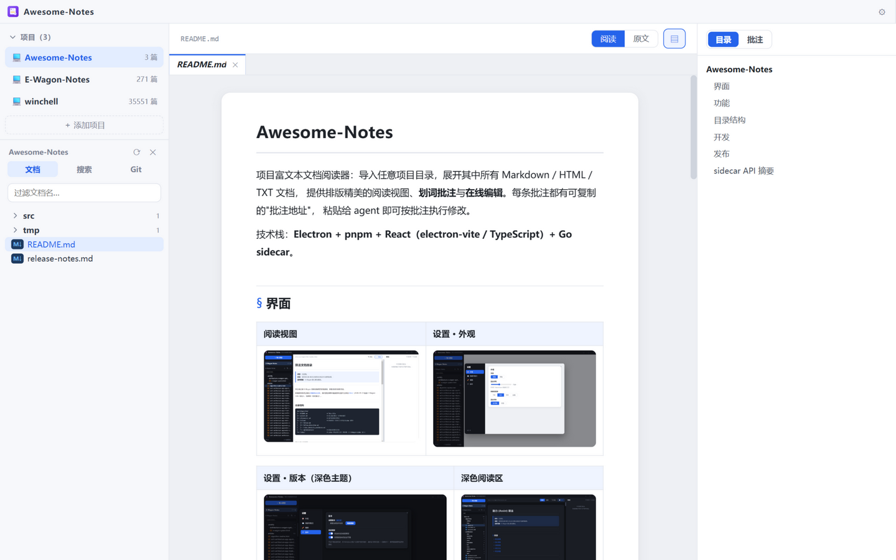

<div align="center">



# Awesome-Notes

项目富文本文档阅读器 —— 面向工程师的文档阅读、批注与轻量 Git 工作台

[](https://github.com/salmoshu/Awesome-Notes/releases)
[](LICENSE)


</div>

## 简介

Awesome-Notes 是一个本地优先的桌面应用，用来**阅读和管理工程项目的文档**：把任意项目目录（本地、WSL、远程机器）导入进来，即可获得纸张式阅读体验、划词批注、全文搜索、多标签浏览和内建 Git 状态面板。批注可一键复制为结构化地址，直接交给 AI Agent 执行修改——让"读文档、记想法、派任务"在一个工具里闭环。

## 核心特性

- **多源项目管理** —— 本地文件夹 / WSL 发行版（自动探测）/ Docker / SSH 远程主机（自动部署 notesd 服务端），项目可折叠分组、重命名、屏蔽
- **纸张式阅读** —— Markdown（GFM、代码高亮）、HTML（真实渲染，页内交互可用）、图片与常见文本格式；字号 / 行宽 / 衬线可调，浅色 / 深色 / 跟随系统主题
- **划词标注** —— 选中文字即可添加标签、笔记或批注（批注交给 Agent 修改，笔记记录思考），正文高亮回显；标注面板集中管理（待处理 / 已完成 / 编辑），支持单条复制与**全量汇总复制**（可直接粘贴给 Agent 批量处理）；阅读与编辑（原文）模式均可划词打标，目录 / 批注在两种模式下都可用并可定位跳转
- **多文档标签** —— VSCode 语义：单击预览、双击固定，标签独立记忆滚动位置、编辑草稿与面板状态
- **文件树操作** —— 右键菜单支持重命名 / 复制（副本）/ 删除 / 新建文档 / 新建文件夹；文档与目录可拖拽移动（目录间或移回项目根），移动时批注锚点自动跟随迁移
- **全文搜索** —— 项目内跨文档内容搜索，命中高亮、行号定位，点击跳转并自动滚动到命中处；Ctrl+F 文档内查找
- **内建 Git** —— 分支与领先/落后、变更列表（M/A/D/R/U 徽标）、暂存 / 取消暂存 / 丢弃、查看更改（差异着色）、提交与拉推，分组可折叠
- **文档内链接直达** —— 相对路径文档 / 图片 / JSON 等链接在应用内直接打开，外部链接走内置浏览器浮层（可返回、错误页友好）
- **自动更新** —— 基于 GitHub Releases，推标签自动构建发布；应用内升级静默完成，沿用上次安装选项并自动重启

## 安装

从 [Releases](https://github.com/salmoshu/Awesome-Notes/releases) 下载最新 `Awesome-Notes-Setup-x.y.z.exe` 安装即可（Windows 10/11 x64）。

> 安装包未做代码签名，首次运行 Windows SmartScreen 可能提示，点击"更多信息 → 仍要运行"即可。

## 快速上手

1. 启动后点击左侧「＋ 添加项目」，导入一个包含文档的目录（或选择 WSL / 远程连接）
2. 在文件树中单击文档预览阅读，双击固定为独立标签
3. 选中正文文字即可添加标签 / 笔记 / 批注；标注面板中可复制单条或全部标注地址
4. Markdown 的「阅读模式」（📖）可直接编辑排版后的正文；「编辑模式」（✎）可编辑 Markdown 源码。两种模式共用草稿与右侧目录 / 标注面板（目录在编辑模式下按标题行定位跳转），Ctrl+S 保存，也可开启自动保存；双击正文只选中文字，不切换模式
5. 文件树右键可重命名 / 复制 / 删除 / 新建，拖拽文档或目录到目标文件夹即可移动；右上角 ⚙ 进入设置：主题（跟随系统 / 浅色 / 深色）、排版、支持格式（Markdown / HTML / JSON 等）与版本更新

## 技术架构

| 层 | 技术 | 说明 |
| --- | --- | --- |
| 桌面壳 | Electron 33 + electron-vite | 自定义标题栏、无边框窗口、自动更新 |
| 前端 | React 18 + Zustand + Vditor | 可编辑的 Markdown 阅读视图与原文编辑，同时支持纯 Web 预览（`pnpm dev:web`） |
| 本地服务 | Go 标准库（notesd sidecar） | 文档扫描/读写、批注存储、全文搜索、Git 操作、WSL 探测；随应用自动启动，意外退出自动重启 |
| 构建 | electron-builder + GitHub Actions | 推 `v*` 标签自动构建并发布 Release |

## 开发

```bash
pnpm install          # 安装依赖（自动下载 electron 运行时）
pnpm dev              # Electron 开发模式
pnpm dev:web          # 纯 Web 预览（需手动启动 sidecar，见 vite.web.config.ts 注释）
pnpm typecheck        # 类型检查
pnpm dist             # 完整打包（sidecar + 渲染层 + 版本标记校验 + NSIS 安装包）
```

发布：更新 `package.json` 版本与 `release-notes.md`（只保留最新版本说明），提交并打 `v*` 标签推送，CI 自动构建发布。

## License

[MIT](LICENSE)
