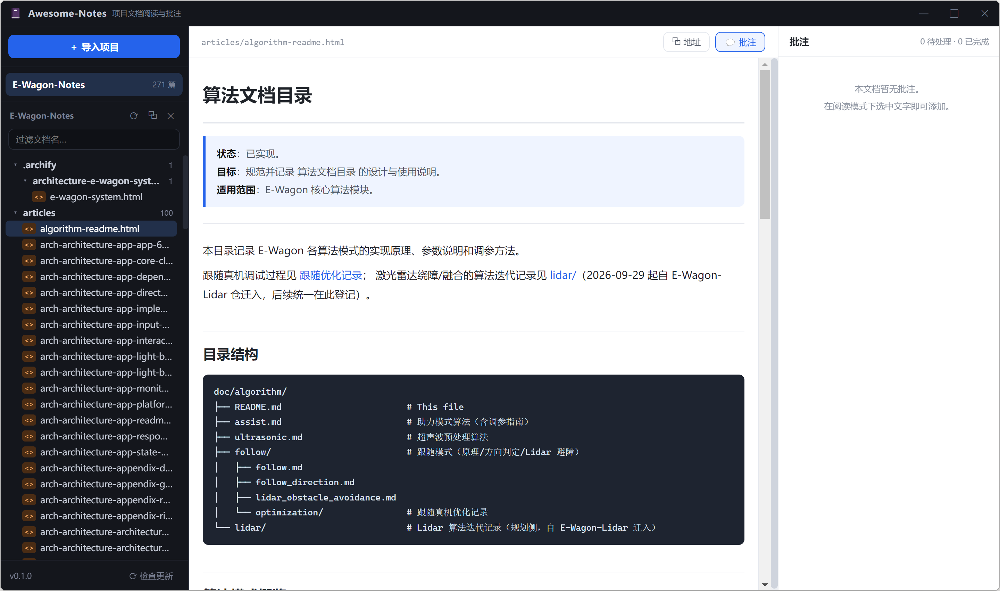
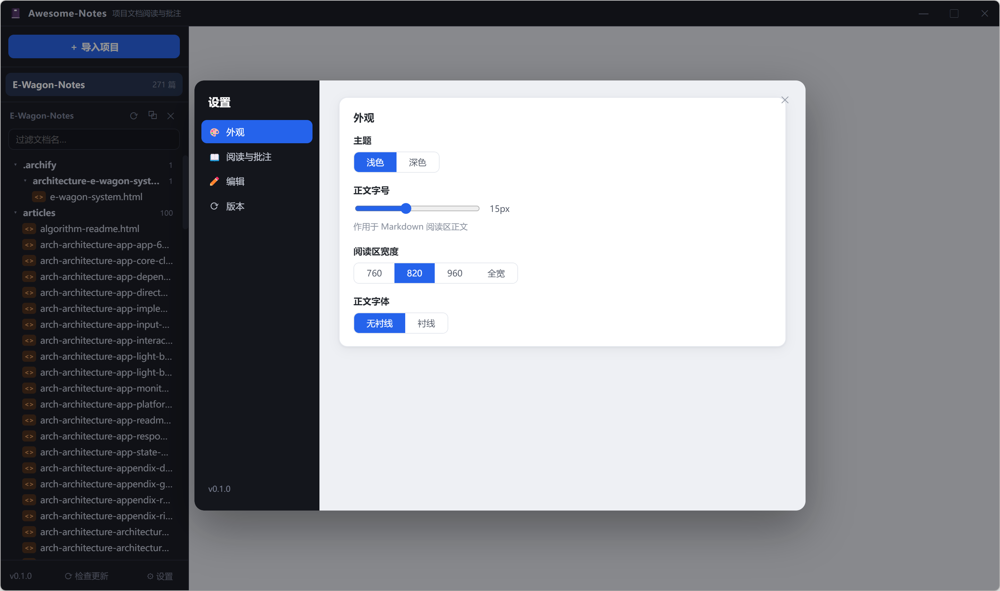
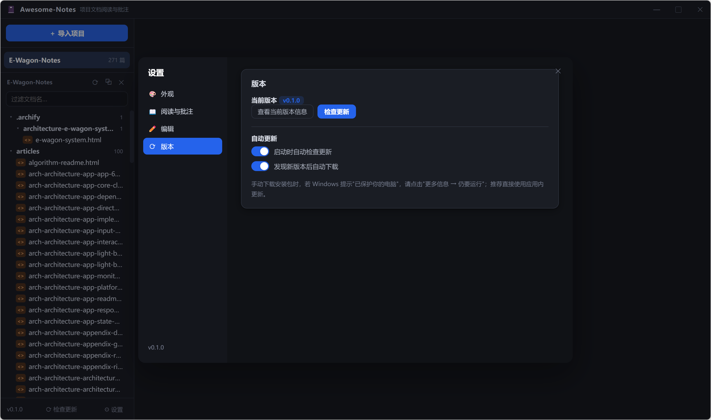
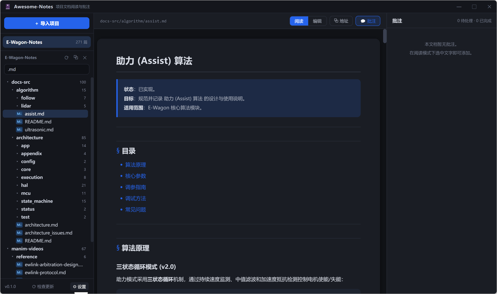

# Awesome-Notes

项目富文本文档阅读器：导入任意项目目录，展开其中所有 Markdown / HTML / TXT 文档，
提供排版精美的阅读视图、**划词批注**与**在线编辑**。每条批注都有可复制的"批注地址"，
粘贴给 agent 即可按批注执行修改。

技术栈：**Electron + pnpm + React（electron-vite / TypeScript）+ Go sidecar**。

## 界面

| 阅读视图 | 设置 · 外观 |
|---|---|
|  |  |

| 设置 · 版本（深色主题） | 深色阅读区 |
|---|---|
|  |  |

## 功能

- **项目导入**：选择本地目录（含 WSL UNC 路径），自动扫描全部富文本文档，
  跳过 `.git` / `node_modules` / `dist` 等目录；文档树支持过滤与折叠。
- **阅读**：Markdown 以"纸张卡片 + 精细化中文排版"呈现（GFM 表格、代码高亮、
  引用块、列表）；HTML 在沙箱 iframe 中原样渲染；TXT 等宽预览。
- **批注**：阅读模式选中文字 → 浮动按钮 → 写下要求；正文以黄色高亮标记锚点，
  右侧面板管理（定位 / 完成 / 重开 / 删除 / 复制地址）。
  锚点 = 引用原文 + 前后各 40 字符上下文，文档被编辑后仍可据此重新定位。
- **编辑**：CodeMirror 6 Markdown 编辑器，`Ctrl+S` 或工具栏保存（原子写盘）；
  可在设置中开启自动保存（停止输入 1s / 2s / 3s 后落盘）。
- **设置中心**：侧栏底部入口，四个分区——外观（浅色/深色主题、正文字号、
  阅读区宽度、衬线/无衬线字体）、阅读与批注（默认模式、批注面板默认展开）、
  编辑（自动保存）、版本（更新检查与偏好）。即改即存，重启保留。
- **深色主题**：覆盖阅读区、CodeMirror 编辑器、批注面板与设置页。
- **版本更新**：electron-updater + GitHub Releases；启动自动检查、右下角更新浮层、
  忽略版本、设置页版本区（查看当前版本更新日志、检查/下载/重启更新单按钮）。
- **批注地址**：格式如下，直接粘贴给 agent：

  ```
  [Awesome-Notes 批注任务]
  链接: awesome-notes://<项目名>/<文档相对路径>#<批注ID>
  文档: <文档绝对路径>
  批注库: <项目>\.awesome-notes\annotations.json
  批注ID: ann-xxxxxxxx
  引用: <被批注的原文>
  要求: <要做的修改>
  ```

  agent 可按"文档"路径直接改文件；批注库是标准 JSON，也可被脚本批量消费。

## 目录结构

```
sidecar/            # Go 后端（仅标准库）：文档扫描 / 读写 / 批注存储，HTTP API
  main.go           #   入口与 CORS
  api.go            #   REST 路由
  scan.go           #   项目注册表 + 文档树扫描（UNC 安全）
  store.go          #   批注库（<项目>/.awesome-notes/annotations.json，原子写）
src/
  main/             # Electron 主进程：窗口、sidecar 拉起（随机端口+令牌）、IPC
  preload/          # contextBridge 暴露 awesomeNotes 桥
  shared/           # 三进程共享类型
  renderer/         # React 界面：Sidebar / Reader / MarkdownView / AnnotationPanel / EditorPane
scripts/            # install-native（electron 运行时镜像下载）、build-sidecar
```

## 开发

```bash
pnpm install        # 首次：自动补齐 electron 运行时（npmmirror）
pnpm dev            # 构建 sidecar + 启动 electron-vite（桌面窗口，渲染层 http://localhost:7100）
pnpm dev:web        # 仅渲染层 Web 预览（需先手动启动 sidecar，见下）
pnpm build          # 产物到 out/
pnpm dist           # electron-builder 打包（NSIS）
```

## 发布

版本号在 `package.json`，更新日志维护在 `release-notes.md`（按 `## vX.Y.Z` 分节，
应用内「设置 → 版本 → 查看当前版本信息」与更新浮层都按节切取展示）。

```bash
pnpm dist                                # 构建 NSIS 安装包到 release/
pnpm exec electron-builder --publish always   # 构建并发布到 GitHub Releases（需 GH_TOKEN）
```

发布目标仓库在 `electron-builder.yml` 的 `publish` 节（owner/repo）。GitHub Release
发布后，旧版本客户端即可通过 latest.yml 检测到更新。

纯 Web 预览用的 sidecar（PowerShell / Git Bash 均可）：

```bash
sidecar/bin/notesd.exe -addr 127.0.0.1:37123 -token dev-token -data ./sidecar/data
```

Go 工具链：优先使用项目内便携版 `.toolchain/go`（不污染系统），其次 PATH 中的 go。
sidecar 也可独立作为命令行文档服务使用（`notesd.exe -addr ... -token ...`）。

## sidecar API 摘要

| 方法 | 路径 | 说明 |
|---|---|---|
| GET | `/api/health` | 健康检查（免令牌） |
| GET/POST | `/api/projects` | 项目列表 / 导入（body: `{path}`） |
| DELETE | `/api/projects/{id}` | 移除项目（不动磁盘） |
| GET | `/api/projects/{id}/tree` | 文档树 |
| GET/PUT | `/api/projects/{id}/doc?path=` | 读 / 写文档 |
| GET/POST/PATCH/DELETE | `/api/projects/{id}/annotations` | 批注 CRUD |
| GET | `/api/projects/{id}/annotations-file` | 批注库绝对路径 |

除 `/api/health` 外均需 `X-Notes-Token` 头。仅监听 127.0.0.1。
